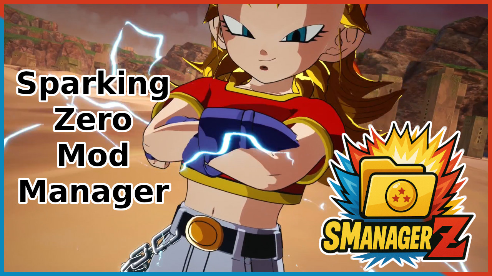
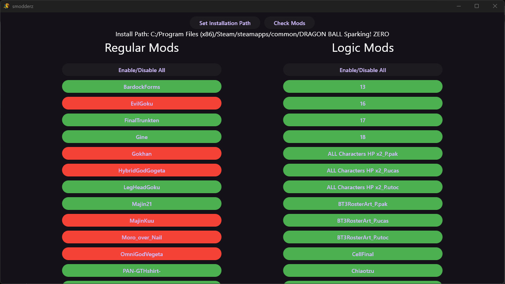

# SModderZ

This is a mod manager for Dragon Ball: Sparking Zero, it helps you quickly and easily enable and disable mods for your game.

## How To Use

### Video

### Text

1. Download the mod manager
1. The directory you run the manager in will generate a folder called mods, in this folder there will be 2 other folders, logic and regular
1. Copy your logic mods (`...DRAGON BALL Sparking! ZERO\SparkingZERO\Content\Paks\LogicMods`) into logic and regular mods (`...DRAGON BALL Sparking! ZERO\SparkingZERO\Mods`) into regular
1. Click "Check Mods" to update available mod list
1. Red mods are not enabled, green mods are enabled

## Building

If you want to build it yourself, here are easy steps:

Install VSCode and install the Flutter extension for VSCode. It will prompt you to install Flutter and project dependencies. You can run the project from VSCode.

---

If you want to support the work I do, please consider donating to me on one of these platforms:

